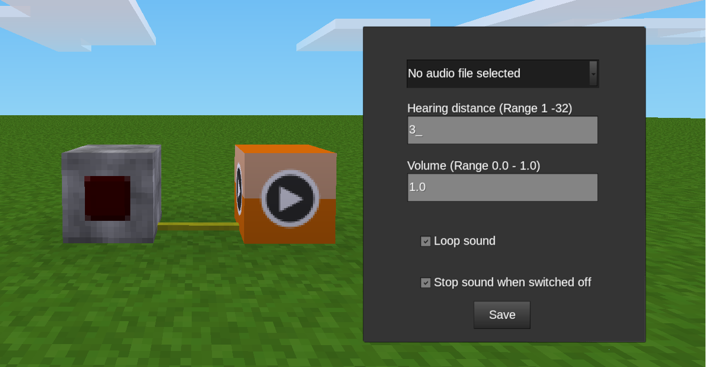

# Mesecons Audio Mod

Der Mod »Mesecons Audio« ermöglicht es, Audiodateien in Minetest einzubinden. Abhängigkeit: mesecons.

With this mod you can use audio files in Minetest. You need the mesecons_audio privileg for setting (but not for playing). Depends: mesecons.
## [download](https://github.com/mmmsued/mesecons_audio)

Verwendung:
Man benötigt das Privileg »mesecons_audio«, um das Formspec des Blockes mit Rechtsklick öffnen, bearbeiten und speichern zu können.

Hinweise:
Das Dateiformat der Audiodateien muss .ogg sein (am besten Mono). Der Dateiname sollte dem Schema »ma_dateiname.ogg« folgen, wobei »ma« für »Mesecons Audio« steht. Bei Sonderzeichen im Dateinamen werden diese im Dropdown-Menü des Blocks zwar angezeigt, können aber nicht abgespielt werden.

Mit »Hearing Distance« stellt man ein, wie dicht ein:e Spieler:in vor dem Block stehen muss, damit der Ton beim Anklicken gehört werden kann. Auch alle anderen Spieler:innen in »Hearing Distance« hören den Ton.

Hat man einen Audioblock gesetzt und fügt dem Sounds-Ordner nachträglich Töne hinzu, werden die neuen Töne nicht in der Dropdown-Liste angezeigt. Man müsste den Block neu setzen.

Läuft der Sound bereits, führt erneutes Anklicken des Mescon-Schalter zum kompletten Neustart des Tones.

Lizenz:
Copyright (C) 2020 Norbert Thien, multimediamobil - Region Süd, Lizenz: Creative Commons BY-SA 4.0
